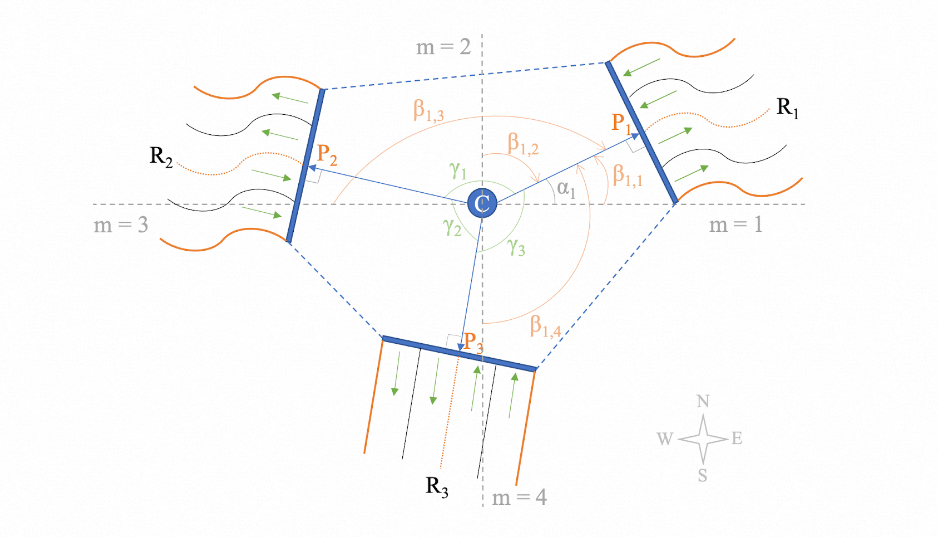
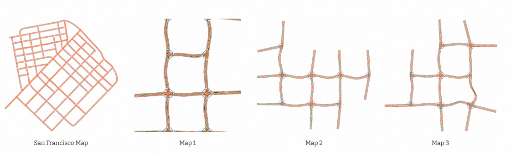
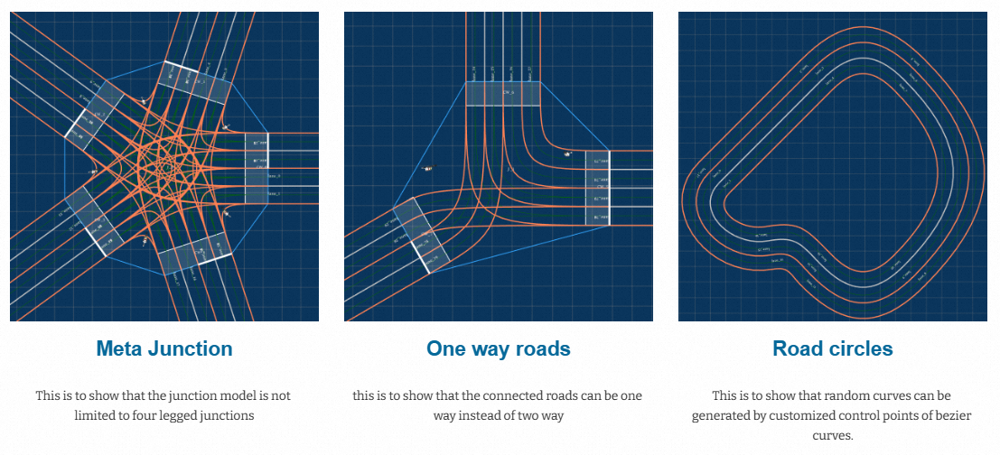
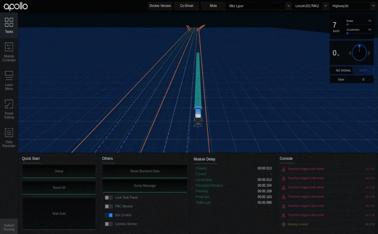



Introduction
---

We've generated test scenarios based on the geometry and topology information extracted from the HD maps, either without or with dynamic obstacles. 

Our methods thus suffers from a intrinsic limitation, which is the limitation of the HD map itself. 

If the HD maps are limited, the types of scenarios generated by whichever methods will be fundamentally limited.

For example, if there are no junctions in the map, we will not be able to generate any junction scenarios.

To address this issue and complement the previously proposed methods, we propose the following feature-based HD map generation method to automatically generate HD maps ready for simulation testing based on manually required features or automatically extracted features from existing maps. 

Map Modeling
---

We focus on the city-driving scenarios and as mentioned previously, there are two main elements: roads and junctions. 

<b>*Road Modeling*</b>

Road consists of parallel lanes, which can be represented by their central curve and land width. 

We use the cubic Bézier curve to model lane central curves and boundaries. 

<b>*Junction Modeling*</b>

Junctions are the places where roads connects with each other.  We model the junctions by means of road sockets as shown in the diagram below.

Each junction has a logic center C, which is located at the center of its polygon.  The roads are linked by the so-called road sockets, represented by vectors starting from the junction's logical center C to the start point of the road's central curve. 

Vectors have length and rotation. For simplicity, we fix length to be 10 meters and focus on the rotation feature, as the rotation feature essentially determines the overall shape (geometry) of the constructed junction.  For example, the rotation angles of the three road vectors in the diagram below are 30 degrees, 160 degrees, -95 degress, all measured from the east direction. 
As mentioned earlier, each route contians two roads and one junction. 

Grid-layout guided HD map construction
---

After we have the models for roads and junctions, the next step is to find out where to construct the junctions and how to connect them, such that the junctions are connected as much as they can and there are no overlaps of the roads. 

In this study, we use a grid-layout to guide the junction construction. 

We first initialize an grid container, with one initial grid point which accepts any types of junction.

Then we sample junction configurations (e.g. number of roads, road socket rotations, crosswalks, traffic light / stop signs etc.) and assign the junction to the available grid points one by one. Upon each assignment, the grid is extended by adding grid points in four directions, i.e. east, north, west and south, if there is no grid points added previously. The newly added grid points are then available for new junction assignments. 

Features like number of roads, road socket rotations, crosswalks, traffic controls (traffic light or stop signs) can be extracted and merged from existing HD maps, or manually defined. 

Since the rotation feature of road sockets are continues, we may generate unlimited samples and thus generate unlimited maps. As shown below, based on the features extracted form the input San Francisco map, we generated three random HD maps ready for testing. 

As mentioned earlier, the method aslo accepts manual feature definitions. The generated maps are shown below:

3D HD map generations are also supported (only for the purpose of simulation-based testing). 

Shown below is a test scenario on a 3D flyover with lane-following obstacles:

This work is currently under review. More details will be released later.

