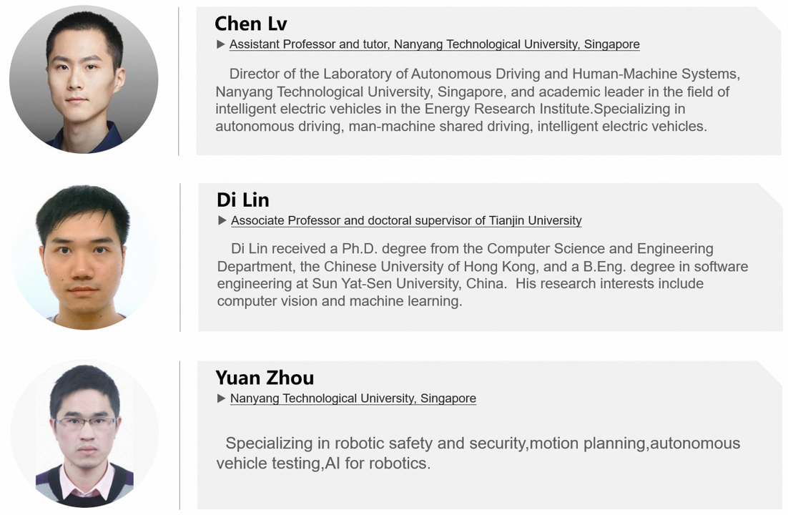
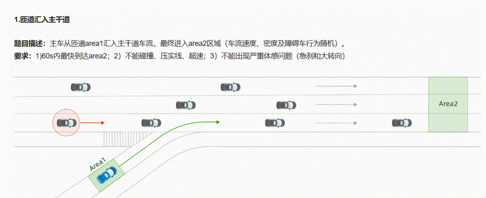
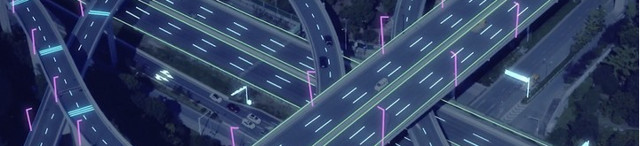
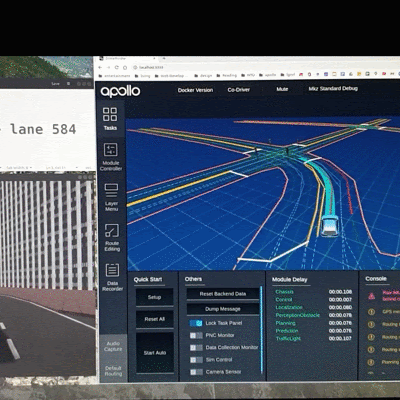
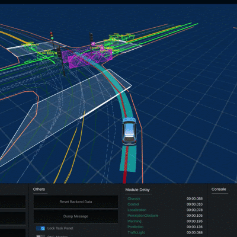
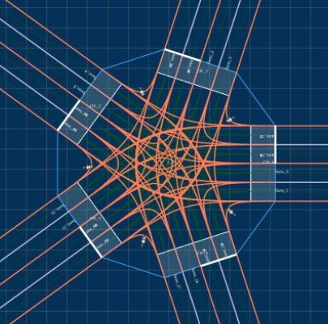

Introduction
---

The <b>Autonomous Driving Simulation Tests </b>use a variety of simulation techniques to test autonomous driving technologies in multiple dimensions. Simulation testing is a basic key technology for autonomous driving R&D. Compared with the real road test, which has high cost, many restrictions and low efficiency, virtual simulation system can provide richer and more diverse static environments and continuous dynamic random traffic flow, which can effectively increase the frequency and density of high test/training value scenes within the limited virtual test mileage, and it has become the common demand for the research and development of automated driving systems by most domestic and foreign enterprises.

Since its establishment, <b>Alibaba Autonomous Driving Lab</b> has been committed to the development and testing of autonomous driving technology, with outstanding achievements. Currently, our research interests are as follows:

* <b>Autonomous driving data mining and clustering
* <b>Simulation scenario modeling and generation
* <b>Safety scenario analysis and reconstruction
* <b>Fault injection and adversarial attacks
* <b>Accelerated longtail scenario generation
* <b>Interactive scenario generation

We sincerely hope that more scholars and knowledgeable people will join our team and work together to promote the development of autonomous driving technology. If you are interested in this program, please contact <b>kairui.ykr@alibaba-inc.com</b>.

Cooperators
---
Alibaba is working with renowned universities at home and abroad on research into autonomous driving technology. At present, the main members of the research team are as follows:

Tianchi Competition
---

<b>Smart Scenario Innovation Challenge - Intelligent Algorithm Competition of the Global "Future Vehicle" 2022</b>

<a href="https://www.bilibili.com/video/BV1zs4y1z78o/?vd_source=3fb97c18845c3bdc2c9938cffb353745">Introduction Video</a>
> As the first high-speed autonomous driving simulation Challenge in China, the competetion relies on the powerful Ali Cloud infrastructure "Cloud efficient car training", attracted more than 1,500 teams to participate, with master and Bo accounting for 15% and C9 universities accounting for 56%. One of the top judges in the autonomous driving industry and a number of professors from prestigious universities.

The Autopilot Simulation Competition provides multiple traffic test scenarios for the participating teams under the simulation environment, which cover common high-speed scenarios and include real accident scenarios with good typicality and generalization value. It mainly tests the decision-making ability of automatic driving vehicles in various complex traffic environments, and participants can train and evaluate the algorithmic ability of the intelligent body through the Ali simulation platform.

Click <a href="https://tianchi.aliyun.com/competition/entrance/531996/information">here</a> to learn more about the detailed contest questions, scoring rules, etc. 

Industry Applications
---
<b>First Highway Intersection HD-Map Dataset: Matrix Flyover</b>

<a href="https://ntutangyun.github.io/highway-interchange-dataset-website/">Matrix Flyover</a>, a high precision map simulation dataset of high-speed hubs in China, was developed by Alibaba and Nanyang Technological in Singapore. In view of the large amount of testing required for 160,000 km expressway in China and the high cost of high-precision map generation, it is difficult to solve the problem of test generalization. The simulation map data set of high-speed hub is constructed based on simulation generation.

At present, there are 1443 HD Maps, based on Hangzhou real data generalization generation, support mainstream formats (open drive & sumo & apollo), parameter sampling and generalization in line with highway junction design specifications. This Dataset filled the gap of the lack of real and high precision and generalization of hdmap in the industry, and provided the basis for the subsequent map-based construction of more abundant scene library and related automatic driving research. The relevant results were published in the robot top meeting ICRA 2023, [see details](https://arxiv.org/abs/2301.12738).

Learn more from <a href="https://www.bilibili.com/video/BV1EL411S7Kg/?spm_id_from=333.337.search-card.all.click&vd_source=370e92ee1e3cb377b0f7fde76d7af6f6">technical interpretation video</a>.

Highlighted Works
---

	

		

      			
    		

  	

  	

    		

      			TOPOLOGY COVERAGE-GUIDED TESTING
    		

    		

     			Y. Tang et al., “Route Coverage Testing for Autonomous Vehicles via Map Modeling,” 2021 IEEE International Conference on Robotics and Automation (ICRA), 2021, pp. 11450-11456
    		

    		

      			<a href="https://ieeexplore.ieee.org/document/9560890?reason=concurrency"><button data-v-662c1668="">Paper</button></a>
      			<a href="https://flyover202305.github.io//topology-coverage-guided/"><button data-v-662c1668="">Project</button></a>
    		

  	

	

    		

      			
    		

  	

  	

    		

      			COLLISOIN AVOIDANCE TESTING
    		

    		

      			Y. Tang, Y. Zhou, Y. Liu, J. Sun and G. Wang, “Collision Avoidance Testing for Autonomous Driving Systems on Complete Maps,” 2021 IEEE Intelligent Vehicles Symposium (IV), 2021, pp. 179-185 Y. Tang, et al., “Systematic Testing of Autonomous Driving Systems Using Map Topology-Based Scenario Classification,” in 2021 36th IEEE/ACM International Conference on Automated Software Engineering (ASE), Melbourne, Australia, 2021 pp. 1342-1346. 
    		

    		

      			<a href="https://ieeexplore.ieee.org/document/9575536?reason=concurrency"><button data-v-662c1668="">Paper-1</button></a>
      			<a href="https://www.computer.org/csdl/proceedings-article/ase/2021/033700b342/1AjT6sGEmIw"><button data-v-662c1668="">Paper-2</button></a>
      			<a href="https://flyover202305.github.io//collisoin-avoidance/"><button data-v-662c1668="">Project</button></a>
		

    	

  	

    		

      			
    		

  	

  	

    		

      			HDMapNet
    		

    		

      			This work is currently under review. More details will be released later.
    		

    		

       			<a href="https://flyover202305.github.io//HD-map-generation/"><button data-v-662c1668="">Project</button></a>
    		

  	

  	

    		

      			
    		

  	

  	

    		

      			GENERATE INTERCHANGES
    		

    		

      			Yuan Zhou, Gengjie Lin, Yun Tang, “FLYOVER: A Model-Driven Method to Generate Diverse Highway Interchanges for Autonomous Vehicle Testing,” which is Accepted by ICRA 2023
    		

    		

      			<a href="https://arxiv.org/abs/2301.12738"><button data-v-662c1668="">Paper</button></a>
      			<a href="https://flyover202305.github.io//generate-interchanges/"><button data-v-662c1668="">Project</button></a>
    		

  	

