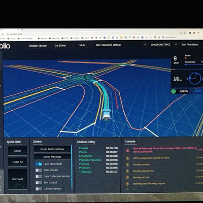
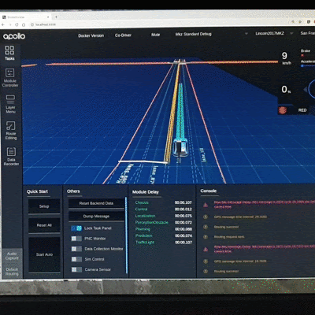



Organizational Structure
---
The Committee on Automatic Driving and Simulation and Testing (CSF-ADST) is affiliated with the China Simulation Society and Tsinghua University, and its initiator, Wu Jianping, is a professor at the Department of Civil Engineering of Tsinghua University and the head of Alibaba's automatic driving simulation. CSF-ADST is composed of enterprise leaders and core experts and scholars covering the fields of autonomous driving, simulation and software testing. The Ad Hoc Committee is an authoritative organization in the field of automatic driving simulation and testing in China, and has played an active role in promoting the development of the industry. Aiming at the core challenges in the field of automatic driving and simulation testing, the committee carries out professional academic exchanges, scientific research cooperation, technology promotion and professional consulting work in the fields of automatic driving and simulation testing theory, education, scientific research and application, etc., which mainly include. 
> Organizing academic conferences, symposiums, competitions and other academic activities - Editing and publishing professional journals, books and media products - Providing professional and technical consulting, and undertaking professional tasks entrusted by the government - Evaluating and consulting on academic achievements, and promoting new theories, technologies, and methods - Organizing and carrying out international academic exchanges and training activities - Assisting and cooperating with the higher-level societies and departments in formulating relevant standards, norms and technical guidelines - Providing professional consultation on national policies in the field of autonomous driving and simulation testing Assisting in formulating relevant standards, norms and technical guidelines in cooperation with higher societies and departments - Playing an advisory role on national policies, development plans and major issues in relevant fields 
> Cooperate with and assist the higher societies in organizing and carrying out relevant program for members.

<h1>Organizers</h1>
            

                <!-- Three columns of text below the carousel -->
                

                    
 
                        <h2><a href="https://hanjianghu.net/">Hanjiang Hu</a></h2>
                        
Ph.D. @ CMU

                    

                    <!-- /.col-lg-4 -->
                    
 
                        <h2><a href="https://jiachengzhuml.github.io/">Jiacheng Zhu</a></h2>
                        
Ph.D. @ CMU

                    

                    <!-- /.col-lg-4 -->
                    
 
                        <h2><a href="https://zuxin.me/">Zuxin Liu</a></h2>
                        
Ph.D. @ CMU

                    

                    
 
                        <h2><a href="https://wenhao.pub/">Wenhao Ding</a></h2>
                        
Ph.D. @ CMU

                    

                    <!-- /.col-lg-4 -->
                

                <!-- /.row -->
            

            

                <!-- Three columns of text below the carousel -->
                

                    <!-- /.col-lg-4 -->
                    
 
                        <h2><a href="https://www.linkedin.com/in/shuaiwa253/">Shuai Wang</a></h2>
                        
Master @ CMU

                    

                    
 
                        <h2><a href="https://www.linkedin.com/in/jiarun-wei-gemini/">Jiarun Wei</a></h2>
                        
AutoX

                    

                    <!--
 
                    <h2>Hassan Azmat</h2>
                    
Master @ CMU

                
-->
                    <!-- /.col-lg-4 -->
                    
 
                        <h2><a href="https://yangbaoquan.github.io/">Baoquan Yang</a></h2>
                        
Undergraduate @ SJTU

                    

                    
 
                        <h2><a href="https://qiaozhijian.github.io/">Zhijian Qiao</a></h2>
                        
PhD @ HKUST

                    

                    <!-- /.col-lg-4 -->
                

                <!-- /.row -->
            

            

                <!-- Three columns of text below the carousel -->
                

                    
 
                        <h2 class="text-center"><a href="https://safeai-lab.github.io/">Ding Zhao</a></h2>
                        
Assistant Professor @ CMU

                    

                    
 
                        <h2 class="text-center"><a href="https://aisecure.github.io/">Bo Li</a></h2>
                        
Assistant Professor @&nbsp; UIUC

                    

                    <!-- /.col-lg-4 -->
                    
 
                        <h2 class="text-center"><a href="https://irmv.sjtu.edu.cn/">Hesheng Wang</a></h2>
                        
Professor @&nbsp; SJTU

                    

                    <!-- /.col-lg-4 -->
                    <!-- /.col-lg-4 -->
                

                <!-- /.row -->
            

            <!-- <h2 class="text-white" >Sponsored By
                <a href="https://global.agilex.ai/" >AgileX Robotics</a>
            </h2> -->
            
            <h3 class="text-white">We are still looking for more sponsors. If you are interested, please contact <a href="mailto:seasondepth@outlook.com">seasondepth@outlook.com</a>.</h3>
            <footer class="container p-5">
                
 Special acknowledgement to Shuai Wang due to building up the user maintenance system for our ICRA 2022 event.

                
<a href="#">Back to top</a>

                
&copy; The SeasonDepth Committee &middot; All Rights Researved.

                
            </footer>
        

Methodology
---
As mentioned earlier, each route contians two roads and one junction. 

We define the following features to classify the junctions:

* has_traffic_light
* has_stop_sign
* has_incoming_crosswalk
* has_outgoing_crosswalk
* topology feature

The topolgy feature is denoted by the co nectivity of the connected roads and thus represents the direction of the traffic flow through the junction.

The following diagram visualizes some of the topology features extracted from the San Francisco map. It can be seen that the topology feature not only records the traffic flow information but also implies the shape (i.e. geometry) of the junction. 

We define the following features to model the driving behavior on roads:

* number_of_lane_changes_before_junction
* number_of_lane_changes_after_junction

The extracted road features are shown below:

We then define the route feature to be a combination of road features and junction features and classify routes extracted from the whole map into route groups. 

In each route group, all the route members are considered equivalent in and can be selected as a representative test case.

As a result, duplicated test cases can be elimitated by selecting only one route from each group, and the total number of test cases is significantly reduced while covering the same level of scenario diverisity. 

Below are some of the discovered issues of the open-source Apollo stack:

	

    		

      			
			
<b>Failed to change lane</b>

    		

  	

  	

    		

      			
			
<b>Stuck at stop sign junction</b>

    		

  	

  	

    		

      			
			
<b>Produced inefficient routing</b>

    		

  	

Readers are referred to the following paper for more details.

Y. Tang et al., "Route Coverage Testing for Autonomous Vehicles via Map Modeling," 2021 IEEE International Conference on Robotics and Automation (ICRA), 2021, pp. 11450-11456, doi: 10.1109/ICRA48506.2021.9560890, [see details](https://ieeexplore.ieee.org/stamp/stamp.jsp?tp=&arnumber=9560890&isnumber=9560666).
