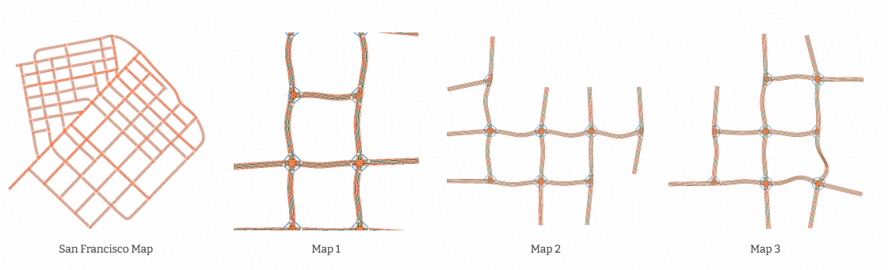
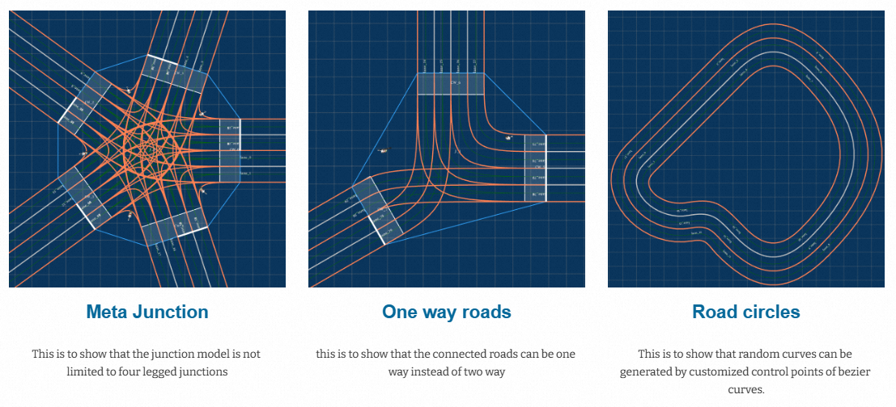

After we have the models for roads and junctions, the next step is to find out where to construct the junctions and how to connect them, such that the junctions are connected as much as they can and there are no overlaps of the roads. 

In this study, we use a grid-layout to guide the junction construction. 

We first initialize an grid container, with one initial grid point which accepts any types of junction.

Then we sample junction configurations (e.g. number of roads, road socket rotations, crosswalks, traffic light / stop signs etc.) and assign the junction to the available grid points one by one. Upon each assignment, the grid is extended by adding grid points in four directions, i.e. east, north, west and south, if there is no grid points added previously. The newly added grid points are then available for new junction assignments. 

Features like number of roads, road socket rotations, crosswalks, traffic controls (traffic light or stop signs) can be extracted and merged from existing HD maps, or manually defined. 

Since the rotation feature of road sockets are continues, we may generate unlimited samples and thus generate unlimited maps. As shown below, based on the features extracted form the input San Francisco map, we generated three random HD maps ready for testing. 

As mentioned earlier, the method aslo accepts manual feature definitions. The generated maps are shown below:

3D HD map generations are also supported (only for the purpose of simulation-based testing). 

Shown below is a test scenario on a 3D flyover with lane-following obstacles:

