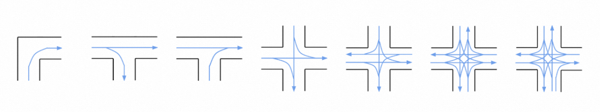
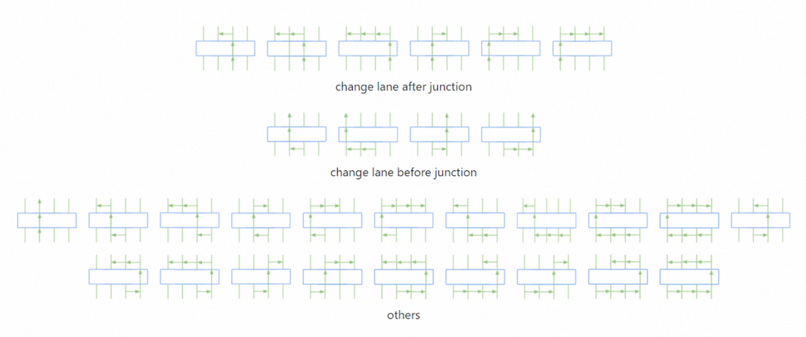
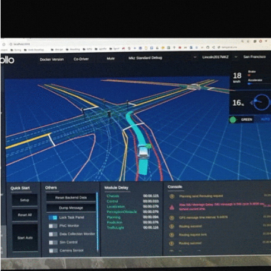
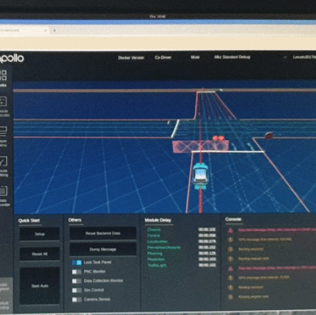
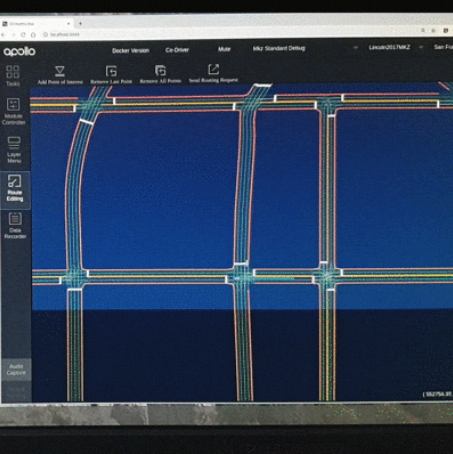

As mentioned earlier, each route contians two roads and one junction. 

We define the following features to classify the junctions:

has_traffic_light

has_stop_sign

has_incoming_crosswalk

has_outgoing_crosswalk

topology feature

The topolgy feature is denoted by the co nectivity of the connected roads and thus represents the direction of the traffic flow through the junction.  

The following diagram visualizes some of the topology features extracted from the San Francisco map. It can be seen that the topology feature not only records the traffic flow information but also implies the shape (i.e. geometry) of the junction. 

We define the following features to model the driving behavior on roads:

number_of_lane_changes_before_junction

number_of_lane_changes_after_junction

The extracted road features are shown below

We then define the route feature to be a combination of road features and junction features and classify routes extracted from the whole map into route groups. 

In each route group, all the route members are considered equivalent in and can be selected as a representative test case.

As a result, duplicated test cases can be elimitated by selecting only one route from each group, and the total number of test cases is significantly reduced while covering the same level of scenario diverisity. 

Below are some of the discovered issues of the open-source Apollo stack:

Failed to change lane

Stuck at stop sign junction

Produced inefficient routing

Readers are referred to the following paper for more details.

Y. Tang et al., "Route Coverage Testing for Autonomous Vehicles via Map Modeling," 2021 IEEE International Conference on Robotics and Automation (ICRA), 2021, pp. 11450-11456, doi: 10.1109/ICRA48506.2021.9560890.[URL](https://ieeexplore.ieee.org/stamp/stamp.jsp?tp=&arnumber=9560890&isnumber=9560666)

