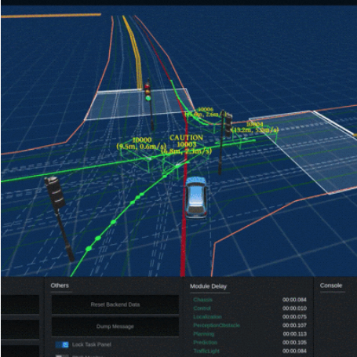

---
<<<<<<< HEAD
title: "Introduction"
=======
title: "INTRODUCTION"
>>>>>>> 503f53d98d027cdbfc201ac3882ad8367c1b39ff
collection: teaching
type: "Undergraduate course"
permalink: /teaching/2014-spring-teaching-1
venue: "University 1, Department"
date: 2014-01-01
location: "City, Country"
---

In city-driving scenarios, collisions often happen in junctions as the connecting lanes of junctions naturally intersects each other. When there is no traffic control (e.g. traffic light or stop signs), vehicles needs to negotiate the right of way before driving through. When such negotiation fails, collision may happen where the traffic lanes intersect. 

We follow the same definition of a route in the previous work (topoloyg coverage-guided testing) but modify a little bit.  For collision avoidance testing, we no longer care about the lane changes behavior (not because it's less important) before and after junctions and included the intersection feature of each junction lanes which EGO veihcle follows during each test case. 

For each junction lane, each intersection point represents a potential collision area on the junction lane. 

The way how the lanes get intersected by other lanes (e.g. angle of intersection, middle or end) potentially represents different types of collision scenairos. 

We define the intersection feature of each junction lane as a set of tuples, each tuple represents the relative intersection direction by another junction lane. (refer to our paper for more details). Essentially, the intersection feature describes the relative directions from which the NPC vehicles may collide with the ego vehicle moving along the junction lane. 

Similar to the previous work, we collect all the junction lanes and classify them into different junction lane groups based on their intersection feature.

The resulted junction lane classes of the San Francisco map is shown below.

From each junction lane classes, the lanes are considered equivalent in the potential types of collision scenario and thus can be selected randomly to represent its class.

Choosing the junction lane to test is not the end. We need to assign NPC vehicles following its intersecting junction lanes. 

For simplicity, assume the NPC vehicles moves in a constant speed following their assigned path. We then have the following parameters to concretize each test scenario:

each NPC's trigger distance (when to start the NPC vehicle when the EGO is xxx meters away from the junction).

each NPC's driving speed.

Given that each lane may have multiple intersecting lanes, thus multiple NPC vehicles involved in each test. The curse of dimensionality applies and it becomes infeasible to cover all the combinations especially with continuous paramters such as distance and speed. We thus applied the Genetic Algorithm to search towards collision test cases (local optimum). 

The overall diagram is shown below:

Below are some of the collision test cases that we discovered during experiments:

Deadlock

Incorrect transition from yielding to overtaking

Incorrect Prediction of NPC Trajectory

For more details, please refer to our following papers:

Y. Tang, Y. Zhou, Y. Liu, J. Sun and G. Wang, "Collision Avoidance Testing for Autonomous Driving Systems on Complete Maps," 2021 IEEE Intelligent Vehicles Symposium (IV), 2021, pp. 179-185, doi: 10.1109/IV48863.2021.9575536. [URL](https://ieeexplore.ieee.org/stamp/stamp.jsp?tp=&arnumber=9575536&isnumber=9575130)

Y. Tang, et al., "Systematic Testing of Autonomous Driving Systems Using Map Topology-Based Scenario Classification," in 2021 36th IEEE/ACM International Conference on Automated Software Engineering (ASE), Melbourne, Australia, 2021 pp. 1342-1346. [URL]( https://doi.ieeecomputersociety.org/10.1109/ASE51524.2021.9678735)

